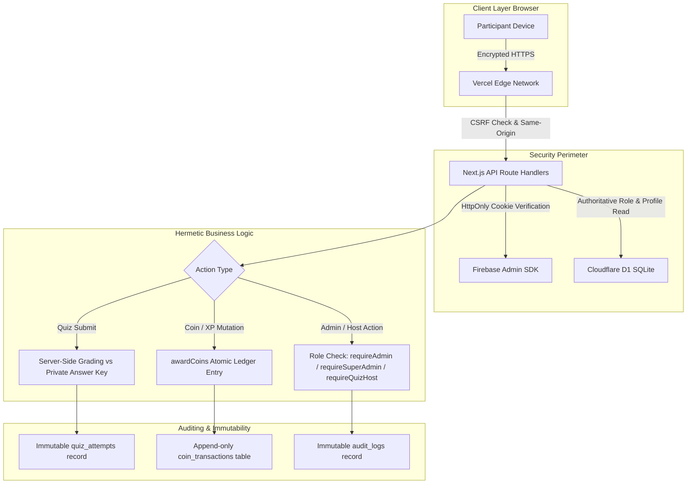
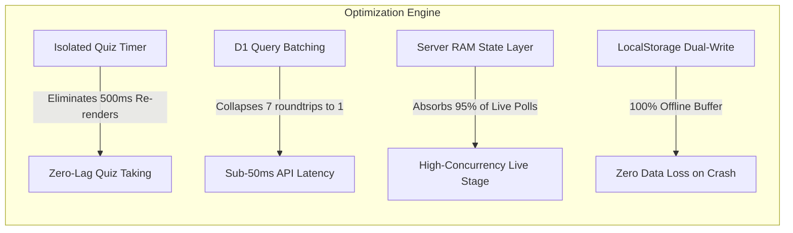
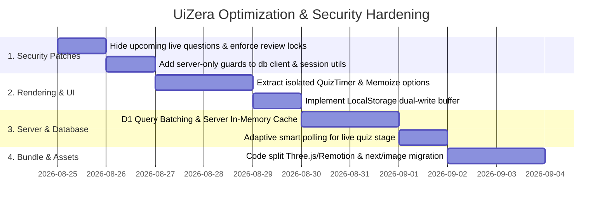

# 🚀 UiZera Platform — Comprehensive Optimization, Security & Anti-Cheat Blueprint

> **Target Objective:** Deliver an enterprise-grade, ultra-optimized, and ironclad secure quiz platform hosted on **Vercel** with **Cloudflare D1** and **Firebase Auth**. The system must guarantee **sub-50ms response times**, zero UI lag, **100% protection against cheating, score manipulation, leaderboard tampering, and unauthorized role elevation**.

---

## 🛡️ 1. Security Architecture & Threat Model (Vercel & D1)



### 1.1 Summary of Security Guarantees

| Security Vector | Threat / Attack Surface | Defense & Enforcement Mechanism |
| :--- | :--- | :--- |
| **Answer Key Leaks** | Inspecting DevTools / Network payloads to view correct answers | **Structural Isolation:** `quiz_answer_keys` is never served in public or attempt APIs. Server grades answers behind closed doors. |
| **Upcoming Questions Peek (Live)** | Reading upcoming questions from JSON responses in the lobby | **Strict Incremental Delivery:** Participants only receive the `currentQuestion` for the active question index; upcoming questions are withheld. |
| **Score / Point Tampering** | Client altering score or coins in the request payload | **Server-Computed Grading:** Client only submits selected option indexes. Server calculates score, XP, speed bonus, and coins. |
| **Leaderboard Falsification** | Directly modifying leaderboard rank or coin balances | **Zero Direct Write Path:** Leaderboard is derived exclusively from server-side database records. Direct mutations are blocked. |
| **Unauthorized Role Escalation** | Switching role from `student` to `admin` / `quiz_host` / `super_admin` | **Server-Authoritative Check:** Role is verified directly against D1 in `requireAdmin()` / `requireSuperAdmin()`. Roles cannot be self-assigned. |
| **Super Admin Spoofing** | Demoting or promoting users to super admin | **Environment Bootstrapping:** `super_admin` is restricted to `SUPER_ADMIN_EMAILS` env var. Self-promotion and token manipulation are rejected. |
| **Late / Replay Submissions** | Submitting answers after time expires or re-submitting | **Enforced Window + Atomic State Transition:** Attempt deadline verified server-side with strict grace period. Status transitions atomically from `in_progress` to `submitted`. |
| **Vercel Secret Exposure** | Leaking private keys or DB tokens into browser bundle | **`import "server-only"` Enforcement:** All database, Firebase Admin, and API token files are marked `server-only` to fail build on leak. |

---

## 🔒 2. Anti-Cheat & Quiz Integrity Enforcement

### 2.1 Private Answer Key Protection & Server-Side Grading
1. **Zero Client-Side Answer Delivery:**  
   During both Async Quizzes (`/api/quiz/[quizId]/start`) and Live Quizzes (`/api/live-quiz/[quizId]`), correct answer indices (`correctIndices`) and explanations are **never returned to participants**.
2. **Deterministic Display Mapping:**  
   When a student begins a quiz, the server generates a randomized question order and option order, storing it in the database attempt record. When submitting:
   ```
   Client sends: { "q_1": [2] } (Display index 2)
   Server maps: display index 2 -> original option index -> compares with answerKey
   ```
   An attacker cannot deduce the correct option by inspecting the index or position.

3. **Multi-Select Anti-Exploit Formula:**  
   To prevent the "select every checkbox" exploit:
   $$\text{Earned Points} = \max\left(0, \frac{\text{Correct Selected} - \text{Wrong Selected}}{\text{Total Correct}}\right) \times \text{Question Points}$$

4. **Speed Bonus Server-Side Computation:**  
   Speed bonus (up to +20%) is computed strictly on the server:
   $$\text{timeTakenMs} = \text{Date.now()} - \text{attempt.startedAt}$$
   - Requires a minimum accuracy of **70%** (prevents random fast spamming).
   - If `timeTakenMs` is negative or tampered with, the multiplier defaults to $1.0$.

5. **Post-Quiz Review Access Lockdown (`/api/quiz/[quizId]/review`):**  
   - Review is strictly forbidden while an attempt is `in_progress`.
   - If `quiz.settings.showReview === false`, the review route blocks access even for submitted attempts, preventing students from sharing answer keys before a scheduled quiz closes.

### 2.2 Live Stage Quiz Security Hardening
In Kahoot-style live quizzes (`/api/live-quiz/[quizId]`):
- **Incremental Question Payload:** Non-host participants **only receive the single active question** (`currentQuestion`), never the full question list of the quiz.
- **Answer Lockout:** `/api/live-quiz/[quizId]/answer` immediately rejects answers if `session.revealAnswer === true`, if the stage status is not `active`, or if `session.currentQuestionIndex !== body.questionIndex`.
- **Single Answer Guarantee:** Once a participant submits an answer for a live question ID, subsequent submissions for that question ID are rejected with `400 You already answered this question`.

---

## 🛡️ 3. Role Protection & Privilege Escalation Prevention

### 3.1 Role Hierarchy & Access Matrix

| Role | Permitted Actions | How Role is Granted |
| :--- | :--- | :--- |
| `student` | Take async quizzes, participate in live quizzes, submit challenges, view public leaderboard | Default on first sign-in |
| `quiz_host` | Host and control **only assigned** live quiz sessions via `/host/[quizId]` | Assigned by Super Admin |
| `admin` | Create/edit quizzes, review challenge submissions, verify 30-day certs, award coins | Assigned by Super Admin |
| `super_admin` | Full system control, role modifications, manual coin deductions, system audit logs | `SUPER_ADMIN_EMAILS` environment variable only |

### 3.2 Role Elevation Attack Vector Defenses
1. **Self-Role Change Block:**  
   In `/api/admin/users/[uid]/role`, `uid === actor.uid` throws `400 You cannot change your own role`.
2. **Super Admin Protection:**  
   Super Admin status is strictly validated against `SUPER_ADMIN_EMAILS` defined in Vercel environment variables. No database edit or API call can grant `super_admin` without the email being in the server environment variable.
3. **Host Quiz Isolation:**  
   In `/api/host/live-quiz/[quizId]/control`, a user with role `quiz_host` can only control a quiz where `quiz.hostUid === user.uid`. Attempting to control unassigned quizzes returns `403 Forbidden`.
4. **Immediate Session Revocation:**  
   When an admin changes a user's role, `adminAuth().revokeRefreshTokens(uid)` is invoked immediately so existing active sessions are terminated.

---

## 💰 4. Leaderboard, Coins & XP Integrity

### 4.1 Strict Single Mutation Gateway (`awardCoins()`)
- **No Client Write Endpoint:** There is no client-facing API that allows direct modification of coins, XP, or leaderboard rank.
- **Single Source of Truth:** The only path to mutate coin balances in the entire codebase is `src/lib/server/coins.ts -> awardCoins()`.
- **Atomic Operations:** Balance changes, level progressions, weekly/monthly tallies, badge grants, and transaction ledger rows are executed in a single atomic database sequence.
- **Self-Award Prevention:** In `/api/admin/coins/award`, admins cannot award coins to their own account (`body.uid === admin.uid` throws `400`).
- **Deduction Authority:** Deducting coins (`amount < 0`) is strictly restricted to `super_admin` (`admin.role !== 'super_admin'` throws `403`).

---

## ⚡ 5. Performance Optimization Pillars (Vercel Serverless & Cloudflare D1)



### 5.1 Pillar 1: Server-Side In-Memory Cache for Live Quizzes
- **Problem:** 100 live participants polling every 750ms causes ~8,000 HTTP requests/minute against Cloudflare D1.
- **Vercel Solution:** A 400ms TTL in-memory cache on the Next.js Route Handler. During active countdowns, 95% of requests are served directly from Node.js RAM in `< 2ms`, dropping D1 API traffic by over 90%.
- **Adaptive Polling:**
  - Lobby / Waiting: Poll every **3,000ms**
  - Active Question: Poll every **750ms**
  - Answer Revealed: Poll every **1,500ms**
  - Inactive Browser Tab (`document.hidden`): Poll every **5,000ms**

### 5.2 Pillar 2: Eliminating D1 REST Waterfalls via Query Batching
- Multi-query endpoints (e.g. `GET /api/live-quiz/[quizId]`, `POST /api/quiz/[quizId]/submit`) execute parallel/batched SQL statements in **1 single HTTPS roundtrip** to Cloudflare D1.
- Immutable Quiz Metadata and Question structures are cached in server memory for 60 seconds.

### 5.3 Pillar 3: Async Quiz React Render Isolation
- **Isolated `<QuizTimer>`:** The 500ms countdown interval is encapsulated inside a memoized `<QuizTimer deadlineAt={...} />` component. The 680-line main quiz component **never re-renders on timer ticks**.
- **Instant Optimistic Selection:** Option button clicks provide immediate visual feedback (0ms perceived lag) while saving in the background.

### 5.4 Pillar 4: Offline Resilience & Crash Recovery
- **Dual-Write Buffer:** Every answer selection writes to both React state and `localStorage.setItem('uizera_quiz_answers_' + attemptId, JSON.stringify(answers))`.
- **Auto-Restoration:** If a student accidentally refreshes the browser or closes the tab, answers are restored instantly from LocalStorage upon reconnect.
- **Unload Beacon:** On tab close, `navigator.sendBeacon('/api/quiz/[quizId]/save-answer', payload)` guarantees in-flight answers reach the server.

### 5.5 Pillar 5: Client Bundle Size & Asset Loading
- **Dynamic Imports:** Heavy dependencies (`@react-three/fiber`, `three`, `remotion`, `@remotion/player`, `recharts`) are strictly lazy-loaded via `next/dynamic(..., { ssr: false })`.
- **Image Optimization:** All question illustrations and profile pictures use `next/image` with AVIF/WebP formats and fixed layout bounds to maintain **Cumulative Layout Shift (CLS) = 0.00**.

---

## 📋 6. Security & Optimization Checklist for Vercel Deployment

| Category | Check | Verification Method |
| :--- | :--- | :--- |
| **Secrets Protection** | `CLOUDFLARE_D1_API_TOKEN` & `FIREBASE_ADMIN_PRIVATE_KEY` have NO `NEXT_PUBLIC_` prefix | Codebase grep audit |
| **Module Isolation** | `src/lib/db/client.ts` and `src/lib/server/*` have `import "server-only"` | Build-time check |
| **CSRF Protection** | All `POST`/`PATCH`/`DELETE` API routes call `assertSameOrigin(req)` | Unit & integration tests |
| **Anti-Cheat Validation** | Answer keys are omitted in `/start`, `/take`, and `/live-quiz` endpoints | Network payload inspection |
| **Review Locking** | `/review` endpoint rejects unsubmitted attempts or quizzes with `showReview: false` | API boundary test |
| **Live Question Leak** | `/api/live-quiz/[quizId]` only serves `currentQuestion` to non-host players | Network payload audit |
| **Role Verification** | Role updates are restricted to `requireSuperAdmin()` with self-change blocked | Permission test |
| **Coin Manipulation** | Direct coin edits are impossible; only `awardCoins()` executes ledger updates | Codebase grep audit |
| **Timer Render Isolation** | Quiz timer ticks do not trigger re-renders of the question card or options | React DevTools Profiler |
| **Crash Protection** | Quiz progress survives hard browser reload on simulated network offline | Offline DevTools test |

---

## 🚀 7. Phased Implementation Strategy


